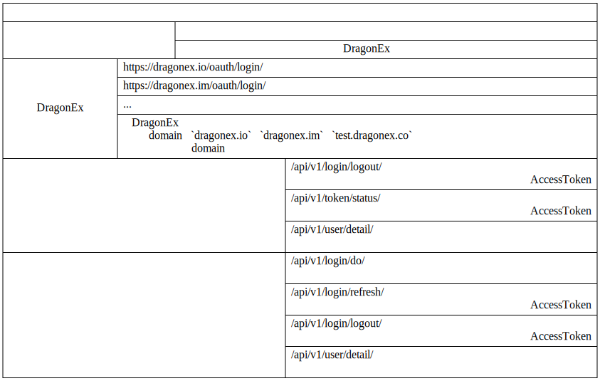

## 对接流程

1. 填写入驻申请表：[中文](https://jinshuju.net/f/MM1Ncj)、[English](https://jinshuju.net/f/kmMfWK)

2. 产品初审：DragonEx工作人员将联系申请者进行商务对接，若初审通过进行后续流程

3. 商务对接：双方商务确定接入币种、产品运营模式、保证金等

4. 技术对接
   
   1. 建立技术对接群，确定对接日程
   
   2. 添加访问测试环境的权限（测试环境有访问限制，没有添加访问权限是无法访问的），并给接入方提供测试环境访问地址
   
   3. 接入方在测试环境[注册](https://test.dragonex.co/zh-hans/account/register)**两个**测试账号：一个用于设置APP的一些信息，如支付回调地址等；一个用于利润划转（若无利润划转需求，此账号可不需要）。建议使用公司邮箱或公司专用手机号注册，避免因公司人员变动产生不必要的麻烦。
   
      

   4. 将注册好的账号提供给DragonEx开发人员，由DragonEx开发添加APP信息。注意区分好两个账号各自的用处，App管理员账号会被冻结交易、提现等与资金相关的权限，分润账号各项权限均正常

   5. 接入方登录管理员账号，进入[“个人中心”-->“开放平台”](https://test.dragonex.co/zh-hans/asset/open/app)，创建AccessKey与SecretKey、配置支付回调地址等

        

       1. **注意**：更新**响应数据校验秘钥**后，前端展示会立即修改，但是DragonEx实际进行签名的会有一小段延时（1H内全部切换为新的秘钥），在此期间可能有部分使用新的秘钥，部分使用旧的秘钥，需接入方在更改秘钥时注意下。

   6. 阅读本文档，进行开发（建议读完本README后，按[目录](#目录)顺序，了解我们提供的接口是否满足您的需求），有疑问可在群里咨询DragonEx开发人员

   7. 接入方自测

   8.  龙网验收（第三方产品流程、产品数据、对账）

5. 正式上线

   1. 接入方在正式环境[注册](https://dragonex.co/zh-hans/account/register)**两个**账号，与在测试环境一致

   2. 接入方填写[《DragonEx开放平台第三方APP信息录入表》](https://jinshuju.net/f/CRKUMu)
   
   3. DragonEx工作人员录入正式环境产品信息（不会展示在开放平台的应用列表）
   
   4. 接入方登录管理员账号，进入[“个人中心”-->“开放平台”](https://dragonex.co/zh-hans/asset/open/app)，创建AccessKey与SecretKey、配置支付回调地址等，与测试环境一致
   
   5. 接入方部署上线，提供正式环境产品链接
   
   6. DragonEx工作人员提供给小部分用户线上灰度测试
   
   7. 灰度测试通过，DragonEx安排开放平台导流

6. 上线后接入方需留意线上数据，并有人负责解答用户疑问

## 目录

1. [服务端请求方式](./docs/cn/1.服务端请求方式.md)
   
2. [客户端请求方式](./docs/cn/2.客户端请求方式.md)

3. [登录相关接口](./docs/cn/3.登录相关接口.md)

4. [支付相关接口](./docs/cn/4.支付相关接口.md)

5. [附录](./docs/cn/5.附录.md)

6. [错误码](./docs/cn/6.错误码.md)

7. [常见问题解答](./docs/cn/7.FAQ.md)

## 登录授权流程图

 1. 用户同意授权后，DragonEx会提供一个AccessCode，并携带此参数跳转到接入方指定的地址（获取AccessCode的流程也可以使用DragonEx统一提供的页面处理，但是这样的话用户要进行登录授权就必须从DragonEx的开放平台列表进入了）

 2. 接入方拿到AccessCode后，需要由接入方服务端带着此AccessCode，以及AccessKey及其签名校验请求DragonEx，获取AccessToken，签名方式见后续说明

 3. AccessKey与SecretKey是重要信息，请勿跟随客户端分发
   

## 开放账户支付流程图

## 币币账户支付流程图

 1. 支付成功后，除了跟随HTTP请求返回支付状态外，还会有异步回调告诉接入方Server端
 
 2. DragonEx无法保证HTTP请求与回调到达的先后顺序，需接入方自行处理可能出现的情况

## 接口列表

1. 登录相关接口列表
   
    

2. 支付相关接口列表
   
    

# 한국어 설명 - Korean

도킹 과정

1. 입학 신청서 작성 : 
[중국어] (https://jinshuju.net/f/MM1Ncj), 
[영어] (https://jinshuju.net/f/kmMfWK), 
[한국어] (https://forms.office.com/Pages/ResponsePage.aspx?id=l0e62TurnEG1w3ZhBPDlsEmuyTo91oVMo8i82Uf8nYNUNFA5VTRJOVpNNkdYTUdIWEpGRTIzTFRKTiQlQCN0PWcu)

2. 제품 예비 검토 : 초기 검토가 후속 프로세스를 통과하면 DragonEx 직원이 비즈니스 도킹 신청자에게 연락합니다.

3. 비즈니스 도킹 : 양 당사자는 액세스 통화, 제품 작동 모드, 마진 등을 결정합니다.

4. 기술 도킹
    
    1. 기술 도킹 그룹을 설정하고 도킹 일정을 결정합니다.
    
    
    2. 테스트 환경에 대한 액세스 권한을 추가하고 
    (테스트 환경에 액세스 제한 사항이 있으며 액세스 권한에 액세스 할 수 없음) 
    테스트 환경 액세스 주소에 대한 액세스 권한을 제공하십시오.
    
    3. 액세스 당사자가 테스트 환경에 있음 [등록](https://test.dragonex.kr/en-us/account/register) **두 개의 ** 테스트 계정 : 하나는 지불과 같은 APP의 일부 정보를 설정하기 위한 것입니다. 콜백 주소 등 (이체 송금 용) (이체 송금 수요가없는 경우이 계정이 필요하지 않을 수 있음) 회사 직원 변경으로 인한 불필요한 문제를 피하기 위해 회사의 사서함 또는 회사 고유의 휴대 전화 번호를 사용하여 등록하는 것이 좋습니다.
   
      

    4. 등록 된 계정을 DragonEx 개발자에게 제공하고 DragonEx의 APP 정보를 추가하십시오. 두 계정의 각각의 용도를 구별하는 데주의를 기울이십시오. 앱 관리자 계정은 동결, 거래, 현금 및 기타 자금 관련 권한이 있습니다.
    
    5. 액세스 당사자가 관리자 계정에 로그인하고 [ "개인 센터"-> "오픈 플랫폼"] (https://test.dragonex.co/zh-hans/asset/open/app)에 들어가서 AccessKey 및 SecretKey를 만듭니다. 결제 콜백 주소 등을 구성합니다.
        
        

        1. ** 참고 ** : ** 응답 데이터 확인 키 **를 업데이트하면 프런트 엔드 디스플레이가 즉시 수정되지만 DragonEx가 실제로 서명하는 데 약간의 지연이 있습니다 (1H 내에 모든 키가 새 키로 전환됨). 이 기간 동안 새 키 중 일부가 사용되고 이전 키 중 일부가 사용될 수 있으므로 접근자는 키를 변경할 때 변경 사항에주의해야합니다.
    
    6. 개발을 위해이 문서를 읽으십시오 (이 README를 읽은 후 [Directory] (# directory)를 눌러 제공하는 인터페이스가 사용자 요구에 맞는지 확인하십시오). 궁금한 점이 있으면 그룹의 DragonEx 개발자에게 문의하십시오.

    7. 접근 자 자체 테스트

    8. 드래곤 네트워크 수용 (타사 제품 흐름, 제품 데이터, 조정)

5. 공식적으로 시작

    1. 접근자는 공식적인 환경에 있습니다 [등록](https://dragonex.co/en-us/account/register)** 두 개의 ** 계정, 테스트 환경과 일치
    
    
    2. 접속 당사자는 [DragonEx Open Platform 타사 APP 정보 입력 양식](https://forms.office.com/Pages/ResponsePage.aspx?id=l0e62TurnEG1w3ZhBPDlsEmuyTo91oVMo8i82Uf8nYNUNFA5VTRJOVpNNkdYTUdIWEpGRTIzTFRKTiQlQCN0PWcu)을 작성합니다.
    
    3. DragonEx 직원이 공식 환경 제품 정보를 입력합니다 (오픈 플랫폼에는 응용 프로그램 목록이 표시되지 않음).
    
    4. 액세스 당사자가 관리자 계정에 로그인하고 ["개인 센터" -> "오픈 플랫폼"](https://dragonex.kr/en-us/asset/open/app)에 들어가서 AccessKey 및 SecretKey, 구성을 만듭니다. 테스트 환경에 따라 콜백 주소 등을 지불하십시오.
    
    5. 액세스 환경은 공식 환경 제품에 대한 링크를 제공하기 위해 온라인으로 배포됩니다.
    
    6. DragonEx 직원은 소수의 사용자에게 온라인 그레이 스케일 테스트를 제공합니다
    
    7. 그레이 스케일 테스트 통과, DragonEx, 개방형 플랫폼 전환 지원

6. 온라인 상태가되면 액세스 당사자는 온라인 데이터에주의를 기울여야하며 누군가는 사용자 질문에 대답 할 책임이 있습니다.

## 디렉토리

1. [서버요청방법](./docs/kr/1.서버요청모드.md)
   
2. [클라이언트요청방법](./docs/kr/2.클라이언트요청모드.md)

3. [로그인관련인터페이스](./docs/kr/3.로그인관련인터페이스.md)

4. [결제관련인터페이스](./docs/kr/4.결제관련인터페이스.md)

5. [부록](./docs/kr/5.Appendix.md)

6. [오류코드](./docs/kr/6.오류코드.md)

7. [FAQ](./docs/kr/7.FAQ.md)

## 로그인 인증 흐름도

! [로그인 인증 순서도](./docs/cn/images/DragonEx开放平台-登录授权流程图.png)

 1. 사용자가 인증에 동의하면 DragonEx는 접근 코드를 제공하고 접근자가 지정한 주소로 이동하기 위해이 매개 변수를 전달합니다 AccessCode를 획득하는 프로세스는 DragonEx가 제공 한 페이지 처리를 사용할 수도 있지만이 경우 사용자는 인증을 위해 로그인해야합니다. DragonEx의 공개 플랫폼 목록에서 입력해야합니다)

 2. 액세스 당사자가 AccessCode를 확보 한 후 액세스 측 서버는 AccessCode와 AccessKey 및 해당 서명 확인 요청 DragonEx를 가져 와서 AccessToken을 가져와야합니다. 서명 방법은 다음 지시 사항에 설명되어 있습니다.

 3. AccessKey 및 SecretKey는 중요한 정보이므로 클라이언트 배포를 따르지 마십시오.
   

## 계좌 개설 흐름도

[계좌 개설 결제](./docs/cn/images/DragonEx开放平台-开放账户支付流程图.png)

## 코인 계좌 지불 흐름도

[지급 순서도] (./docs/cn/images/DragonEx 공개 플랫폼-코인 계정 지불 순서도 .png)

 1. 지불에 성공한 후 HTTP 요청에 따라 지불 상태를 리턴하는 것 외에 액세스 측 서버 측에 알리는 비동기 콜백이 있습니다.
 
 2. DragonEx는 HTTP 요청 및 콜백의 도착 순서를 보장 할 수 없으며 액세스 당사자는 가능한 상황을 처리해야합니다.

## 인터페이스 목록

1. 관련 인터페이스 목록에 로그인
   
! [로그인 관련 인터페이스 목록](./docs/cn/images/login_apis.svg)

2. 결제 관련 인터페이스 목록
   
! [결제 관련 인터페이스 목록](./docs/cn/images/payment_apis.svg)