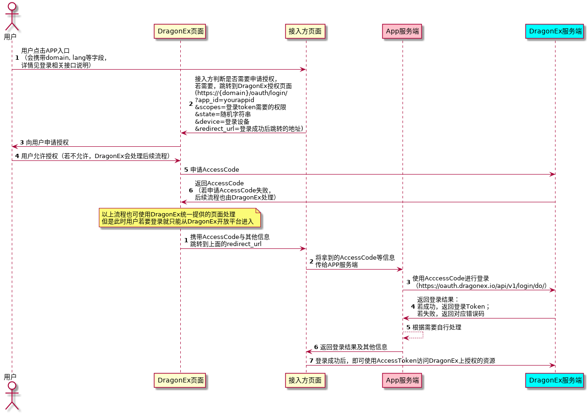
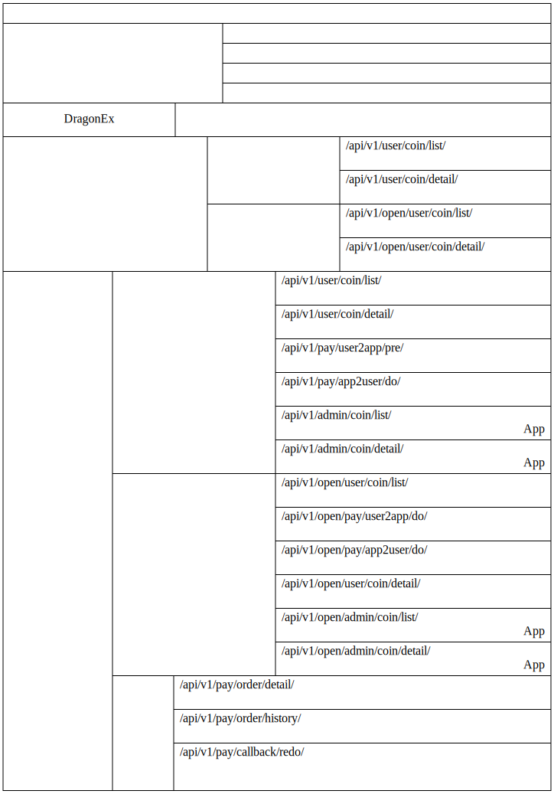

# 说明

## 目录

1. [服务端请求方式](./docs/cn/1.服务端请求方式.md)
2. [客户端请求方式](./docs/cn/2.客户端请求方式.md)
3. [登录相关接口](./docs/cn/3.登录相关接口.md)
4. [支付相关接口](./docs/cn/4.支付相关接口.md)
5. [附录](./docs/cn/5.附录.md)
6. [错误码](./docs/cn/6.错误码.md)

## 对接流程

1. 填写入驻申请表：[中文](https://jinshuju.net/f/MM1Ncj)、[English](https://jinshuju.net/f/kmMfWK)

2. 产品初审：DragonEx工作人员将联系申请者进行商务对接，若初审通过进行后续流程

3. 商务对接：双方商务确定接入币种、产品运营模式、保证金等

4. 技术对接
   1. 建立技术对接群，确定对接日程
   
   2. 添加访问测试环境的权限（测试环境有访问限制，没有添加访问权限是无法访问的），并给接入方提供测试环境访问地址
   
   3. 接入方在测试环境[注册](https://test.dragonex.co/zh-hans/account/register)**两个**测试账号：一个用于设置APP的一些信息，如支付回调地址等；一个用于利润划转（若无利润划转需求，此账号可不需要）。建议使用公司邮箱或公司专用手机号注册，避免因公司人员变动产生不必要的麻烦。
   
      

   4. 将注册好的账号提供给DragonEx开发人员（区分好两个账号各自的用户，App管理员账号会被冻结交易、提现等与资金相关的权限），由DragonEx开发添加APP信息

   5. 接入方登录管理员账号，进入[“个人中心”-->“开放平台”](https://test.dragonex.co/zh-hans/asset/open/app)，创建AccessKey与SecretKey、配置支付回调地址等

        

       1. **注意**：更新**响应数据校验秘钥**后，前端展示会立即修改，但是DragonEx实际进行签名的会有一小段延时（1H内全部切换为新的秘钥），在此期间可能有部分使用新的秘钥，部分使用旧的秘钥，需接入方在更改秘钥时注意下。

   6. 阅读本文档，进行开发（建议读完本README后，按上述[目录](#目录)顺序，了解我们提供的接口是否满足您的需求），有疑问可在群里咨询DragonEx开发人员

   7. 接入方自测

   8.  龙网验收（充提功能、第三方产品流程、产品数据、对账）

1. 正式上线

   1. 接入方在正式环境[注册](https://dragonex.co/zh-hans/account/register)**两个**测试账号，与在测试环境一致

   2. 接入方填写[《DragonEx开放平台第三方APP信息录入表》](https://jinshuju.net/f/CRKUMu)
   
   3. DragonEx工作人员录入正式环境产品信息（不会展示在开放平台的应用列表）
   
   4. 接入方登录管理员账号，进入[“个人中心”-->“开放平台”](https://dragonex.co/zh-hans/asset/open/app)，创建AccessKey与SecretKey、配置支付回调地址等，与测试环境一致
   
   5. 接入方部署上线，提供正式环境产品链接
   
   6. DragonEx工作人员提供给小部分用户线上灰度测试
   
   7. 灰度测试通过，DragonEx安排开放平台导流

## 登录授权流程图

 1. 用户同意授权后，DragonEx会提供一个AccessCode，并携带此参数跳转到接入方指定的地址（获取AccessCode的流程也可以使用DragonEx统一提供的页面处理，但是这样的话用户要进行登录授权就必须从DragonEx的开放平台列表进入了）

 2. 接入方拿到AccessCode后，需要由接入方服务端带着此AccessCode，以及AccessKey及其签名校验请求DragonEx，获取AccessToken，签名方式见后续说明

 3. AccessKey与SecretKey是重要信息，请勿跟随客户端分发
   
## 开放账户支付流程图

## 币币账户支付流程图

 1. 支付成功后，除了跟随HTTP请求返回支付状态外，还会有异步回调告诉接入方Server端
 2. DragonEx无法保证HTTP请求与回调到达的先后顺序，需接入方自行处理可能出现的情况

## 接口列表

1. 登录相关接口列表
   
    

2. 支付相关接口列表
   
    

