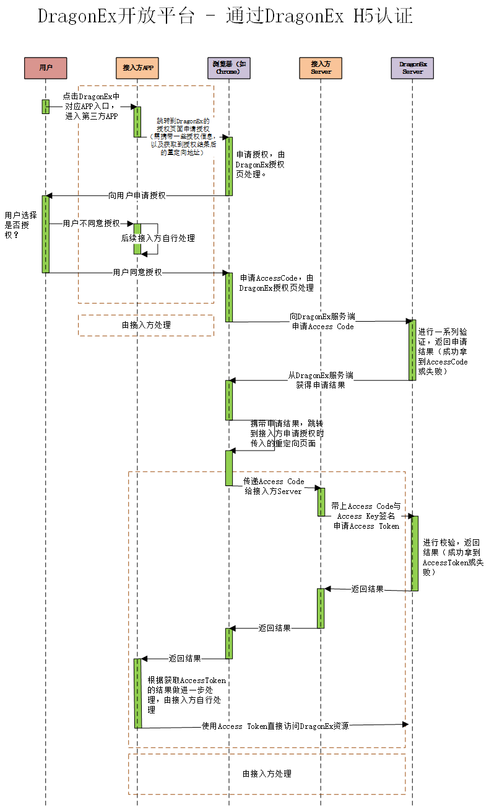

# 说明

## 目录

1. [对接流程说明](./0.对接流程.md)
2. [服务端请求方式](./1.服务端请求方式.md)
3. [客户端请求方式](./2.客户端请求方式.md)
4. [登录相关接口](./3.登录相关接口.md)
5. [支付相关接口](./4.支付相关接口.md)
6. [附录](./5.附录.md)
7. [错误码](./6.错误码.md)

## 登录授权时序图

## 支付时序图

## 接口列表

1. 登录相关接口列表
   
    

2. 支付相关接口列表
   
    