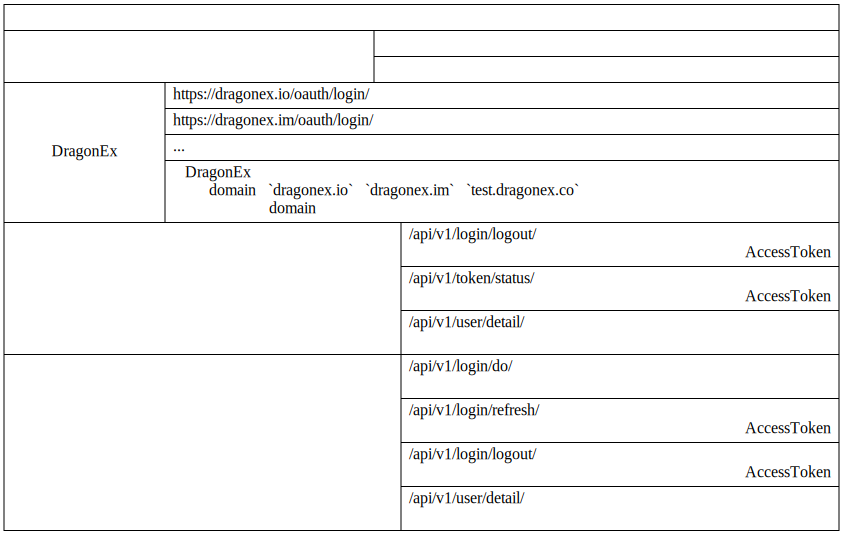
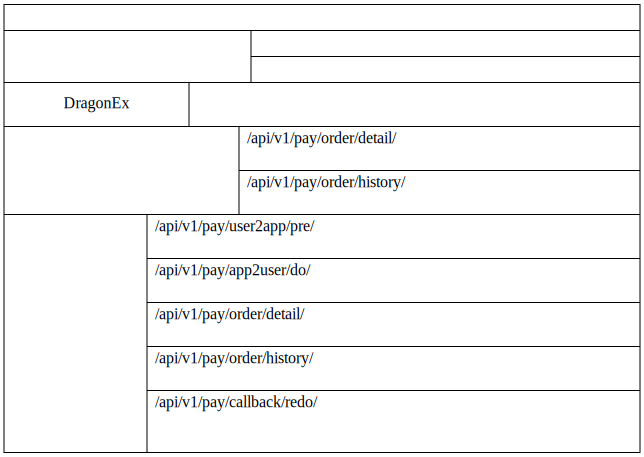

# 설명

## 디렉토리

1. [도킹 프로세스 설명](./0.도킹프로세스.md)
2. [서버 요청 방법](./1.서버요청모드.md)
3. [클라이언트 요청 방법](./2.클라이언트요청모드.md)
4. [로그인 관련 인터페이스](./3.로그인관련인터페이스.md)
5. [지불 관련 인터페이스](./4.결제관련인터페이스.md)
6. [부록](./5.Appendix.md)
7. [오류코드](./6.오류코드.md)

## 로그인 권한 부여 타이밍 다이어그램

## 지불 타이밍 차트

## 인터페이스 목록

1. 로그인 관련 인터페이스 목록
   
    

2. 지불 관련 인터페이스 목록
   
    